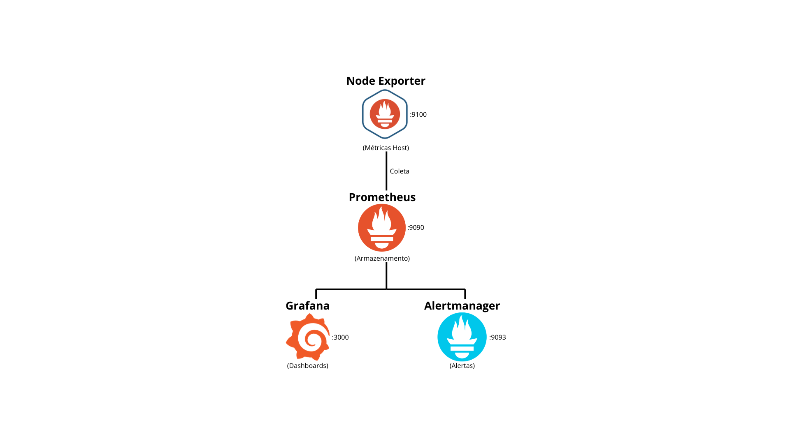

# linux-monitoring-stack


Stack de monitoramento selfhosted. Projeto pessoal de estudos — construído pra documentar o que aprendo no dia a dia como Analista de Infraestrutura.

Inclui Prometheus, Grafana, Alertmanager e Node Exporter, com dashboards e alertas já configurados.

---

## O que contém no projeto

- Coleta de métricas do host Linux via Node Exporter.
- Armazenamento e consulta com Prometheus.
- Dashboards prontos no Grafana.
- Regras de alerta para CPU, memória, disco e disponibilidade.



---

## Pré-requisitos

- Docker 24+
- Docker Compose v2
- Portas 3000, 9090, 9093 e 9100 livres no host

---

## Como subir

```bash
git clone https://github.com/mfrederico/linux-monitoring-stack
cd linux-monitoring-stack
docker compose up -d
```

Pronto. Acessa no browser:

| Serviço | URL | Login |
|---|---|---|
| Grafana | http://localhost:3000 | admin / admin |
| Prometheus | http://localhost:9090 | — |
| Alertmanager | http://localhost:9093 | — |

> O Grafana vai pedir pra trocar a senha no primeiro acesso.

---

## Alertas configurados

| Alerta | Condição | Severidade |
|---|---|---|
| HighCPUUsage | CPU > 80% por 5 minutos | warning |
| HighMemoryUsage | Memória > 85% | warning |
| DiskSpaceLow | Disco > 90% | critical |
| InstanceDown | Host fora do ar por 1 minuto | critical |

---

## Estrutura do projeto

```
linux-monitoring-stack/
├── docker-compose.yml
├── .gitignore
├── README.md
├── prometheus/
│   ├── prometheus.yml
│   └── rules/
│       └── alerts.yml
├── grafana/
│   ├── provisioning/
│   │   ├── datasources/
│   │   │   └── prometheus.yml
│   │   └── dashboards/
│   │       └── dashboard.yml
│   └── dashboards/
│       └── node-exporter.json
└── alertmanager/
    └── alertmanager.yml
```
---

## Sobre o projeto

Esse repositório faz parte do meu portfólio de estudos em Infraestrutura e DevOps. Trabalho como Analista de Infraestrutura e uso projetos como esse pra consolidar o que aprendo — Docker, observabilidade, automação e boas práticas de documentação.

**Marco Antonio Frederico**
[LinkedIn](https://www.linkedin.com/in/mfrederico) · [GitHub](https://github.com/mfrederico)

---

## Licença

MIT
